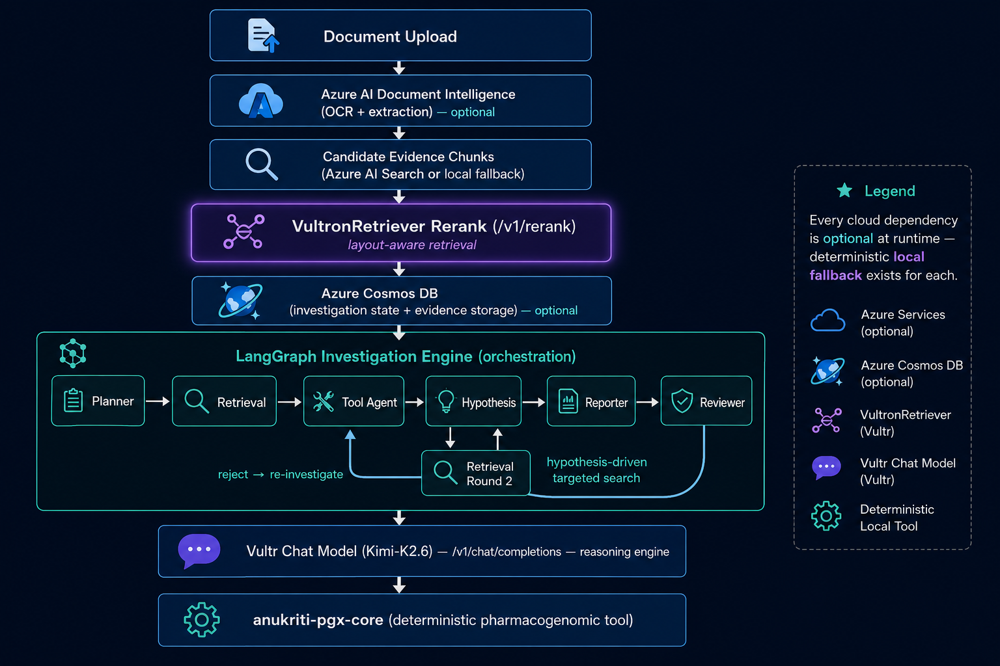

# Sentinel Clinical

> 🏆 **RAISE Summit Hackathon — Vultr Track submission.** Public demo:
> [`http://139.84.159.170:3000`](http://139.84.159.170:3000) ·
> [1-minute demo video](https://www.youtube.com/watch?v=88gJxBA-HvU) ·
> [Detailed video walkthrough (architecture, agents, use case)](docs/media/sentinel-clinical-detailed-demo.mp4) ·
> [Jump to the track compliance table ↓](#raise-summit-hackathon--vultr-track)

Sentinel Clinical is an autonomous adverse drug event investigation
engine. Given a clinical incident (e.g. "patient admitted after
fluorouracil therapy, presenting with neutropenia"), it plans an
investigation, gathers evidence, calls deterministic clinical tools,
generates competing hypotheses with honest confidence scores, drafts a
report, and puts that report through a second, skeptical AI reviewer
before it can be finalized.

The design commitment that runs through the whole system: **Sentinel
refuses to guess.** If the evidence needed to confirm a root cause
(e.g. a pharmacogenomic phenotype) was never retrieved, the investigation
says so explicitly instead of fabricating a confident answer — and the
Reviewer approves that refusal, rather than treating "I don't know" as a
failure. It also refuses to let a report stand on population-level
guidance alone: if the only evidence is "CPIC guidelines say patients
with this phenotype should avoid this drug," the Reviewer treats that as
insufficient until patient-specific genotype confirmation is retrieved.
See `docs/ARCHITECTURE.md` for how each agent enforces this.

## Use case: why this exists

Adverse drug event (ADE) investigation today is mostly manual. A
pharmacovigilance team gets an incident report (e.g. a patient
hospitalized after a chemotherapy cycle), and someone has to: pull the
medication history, check lab trends, look up whether a genetic factor
explains the toxicity, cross-reference CPIC/FDA guidance, weigh
alternative explanations (drug interaction? infection? dosing error?),
and write a report that a second clinician will scrutinize before it's
accepted. That process is slow, inconsistent between investigators, and
— this is the part Sentinel is built around — has no built-in resistance
to a *confident-sounding but under-evidenced* conclusion. A generic LLM
asked "why did this patient get sick" will happily produce a fluent,
specific-sounding answer whether or not the evidence actually supports
it.

Sentinel's worked example is exactly this: a patient develops severe
neutropenia, mucositis, and fever after fluorouracil (a chemotherapy
drug). The textbook explanation is DPYD poor-metabolizer status — a
genetic variant that makes ~1 in 200 patients unable to safely process
fluoropyrimidine drugs, per CPIC guidelines. But "this drug class can
cause this in patients with this genotype" (population-level guidance)
is not the same claim as "this patient has that genotype" (a lab result
that either exists or doesn't). Sentinel is built to keep those two
claims separate all the way through the investigation, and to make the
system's own reviewer catch it if they ever get conflated — instead of
trusting a single LLM call to get that distinction right on its own.

The pattern generalizes beyond pharmacogenomics: any domain where an
automated system might be asked to explain an adverse outcome from
partial evidence — clinical, financial fraud review, industrial incident
investigation — runs into the same failure mode (a model that answers
confidently regardless of whether the evidence supports it). Sentinel's
plan → retrieve → act → hypothesize → report → adversarial-review loop,
with an explicit right to refuse at the end, is a template for that
class of problem, not just a DPYD demo.

## Investigation graph

```
planner → retrieval → tool_agent → hypothesis → reporter → reviewer
                            ↑___________________________________|
                              rejected: back to tool_agent
                              (re-investigate, don't re-plan or
                               re-search from scratch)
```

- **Planner** — turns free-text incident description into a
  fixed-vocabulary task list (`retrieve_medication_history`,
  `retrieve_pharmacogenomics`, `confirm_pharmacogenomic_genotype`,
  `check_drug_interactions`, etc). LLM-backed with a deterministic
  rule-based fallback; defensively re-injects
  `retrieve_pharmacogenomics` if an LLM plan omits it, since the Tool
  Agent hard-requires that exact task name to call the PGx engine.
- **Retrieval Agent** — maps each Planner task to a candidate-search +
  VultronRetriever rerank pass. Two-stage: a cheap broad candidate
  search (Azure AI Search, or local keyword-overlap fallback) followed
  by a precision rerank of those candidates via VultronRetriever's
  `/v1/rerank`.
- **Tool Agent** — executes deterministic clinical tools: `pgx-core`
  (population-level CPIC pharmacogenomic recommendations),
  `genotype-confirmation` (patient-specific diplotype/phenotype lookup,
  called only when the Reviewer's rejection specifically demands it —
  see "Why a genotype-confirmation tool" below), and a hardcoded
  lab-trends stub used the same way.
- **Hypothesis Agent** — the safety-critical node. Generates competing
  hypotheses with confidence scores; enforces a pharmacogenomic
  guardrail both in-prompt and post-hoc in code so the LLM cannot state
  a phenotype as fact when no phenotype evidence was retrieved.
  Patient-specific genotype confirmation (when present) raises the top
  hypothesis's confidence above the single-source cap that a
  guideline-only citation is held to.
- **Reporter** — assembles the structured report (executive summary via
  LLM, everything else deterministic extraction from tool outputs and
  hypotheses). Treats "no hypotheses at all" the same as an explicit
  unconfirmed status, rather than crashing or fabricating confidence.
- **Reviewer** — a second, skeptical AI investigator. Unconfirmed/
  honest-refusal reports are **always** approved deterministically,
  never via the LLM (approving a refusal is not a judgment call).
  Confirmed reports go through an LLM review with a one-way ratchet:
  the LLM can be stricter than the rule-based baseline, never more
  lenient. Rejections route back to the Tool Agent, not the Planner or
  Retrieval Agent — re-investigation, not restart.

### Why a genotype-confirmation tool

`pgx-core`'s CPIC lookup answers "given a phenotype, what should we do
about this drug?" — a population-level guideline, not confirmation that
*this patient* was tested and found to carry that phenotype. In
practice, the live LLM Reviewer flagged exactly this gap: a report
citing only "CPIC says DPYD poor metabolizers should avoid
fluorouracil" is guideline evidence, not patient evidence. The
`genotype-confirmation` tool (`packages/tools/genotype_tool.py`) closes
that gap — a stub today (hardcoded DPYD `*2A/*2A` → Poor Metabolizer
result; in production this would query a clinical genotyping lab's
LIS/LIMS or extract a PGx report via Document Intelligence), called by
the Tool Agent only on a re-investigation pass when the Reviewer's
rejection issues mention genotype/phenotype confirmation by name.

## Architecture at a glance

Two Vultr Serverless Inference models, each doing the job it's actually
built for — plus Microsoft Azure as the secondary/optional data layer:

- **VultronRetriever** (Flash/Core/Prime, Qwen3.5-based, #1 on ViDoRe V3)
  — Sentinel's evidence retrieval engine, via `/v1/rerank`. It reads
  clinical evidence the way a clinician does, with full layout
  awareness (tables, charts, scans), and reranks candidate evidence by
  relevance to the investigation.
- **A Vultr-hosted chat-completion model** (Kimi-K2.6) — the reasoning
  engine behind planning, hypothesis generation, report synthesis, and
  review. VultronRetriever cannot do this job (it has no
  chat-completion capability, confirmed against Vultr's own docs); this
  is a standard `/v1/chat/completions` call on the same endpoint and API
  key.

```
Document Upload → Azure AI Document Intelligence (OCR + extraction, optional)
                        ↓
                Candidate evidence chunks (Azure AI Search or local fallback)
                        ↓
                VultronRetriever rerank (/v1/rerank) ← layout-aware retrieval
                        ↓
                Azure Cosmos DB (investigation state + evidence storage, optional)
                        ↓
          LangGraph Investigation Engine (orchestration)
       planner → retrieval → tool_agent → hypothesis → reporter → reviewer
                        ↓
      Vultr-hosted chat model (/v1/chat/completions) — reasoning
                        ↓
              anukriti-pgx-core (deterministic PGx tool)
```



Every cloud dependency — both Vultr models and all three Azure services
— is **optional at runtime**. Each one has a deterministic or local
fallback, so the full investigation pipeline runs end-to-end with zero
cloud credentials configured. See `docs/ARCHITECTURE.md` for the full
breakdown of what each service does and what its fallback is.

**Known open item:** VultronRetriever currently sits in one node
(Retrieval Agent reranking); all planning/hypothesis/report/review
reasoning runs on the separate Vultr chat model, since VultronRetriever
has no chat-completion capability. See `docs/ARCHITECTURE.md`'s
"Why not VultronRetriever for reasoning" section for the technical
justification, and treat this split as an open design question against
any hackathon rule that requires VultronRetriever to drive the core
reasoning loop rather than one retrieval step within it. See the
"RAISE Summit Hackathon — Vultr Track" section near the end of this
README for the full compliance breakdown.

## Project layout

```
packages/
  agents/          Planner, Retrieval, Tool Agent, Hypothesis, Reporter, Reviewer
  tools/           pgx-core adapter, genotype-confirmation adapter,
                   Document Intelligence adapter, AI Search /
                   evidence-candidate adapter, VultronRetriever rerank
                   adapter, tool registry
  database/        Cosmos DB client (+ local JSON fallback)
  schemas/         InvestigationState (LangGraph state channel)
  graph.py         Builds and runs the LangGraph investigation graph
  llm.py           Vultr Serverless Inference chat model (reasoning)
  config.py        Vultr rerank + Azure availability checks
apps/
  api/             FastAPI app: REST + WebSocket streaming
sentinel-dashboard/
  Next.js live investigation dashboard (agent status, evidence,
  hypotheses, report, timeline) consuming the API's REST + WebSocket
  surface. See sentinel-dashboard/README.md for its own setup.
docs/
  ARCHITECTURE.md  Full multi-cloud, two-model architecture writeup
```

## Setup

Backend:

```bash
python3 -m venv .venv
source .venv/bin/activate
pip install -r requirements.txt
cp .env.example .env   # fill in real values, or leave blank to run on fallbacks
```

Dashboard (optional — the API works standalone via curl/WebSocket):

```bash
cd sentinel-dashboard
npm install
cp .env.local.example .env.local   # point at the running API
npm run dev
```

## Running

Smoke-test the investigation graph directly (no API, no server):

```bash
python -m packages.graph
```

Runs both demo scenarios end-to-end: a confirmed root cause that gets
rejected for thin evidence and re-investigated to approval, and a
refusal (no genotype evidence) that gets approved on the first pass.

Run the API:

```bash
uvicorn apps.api.main:app --reload
```

Then:

```bash
# Health check — reports which backend (cloud vs. fallback) each subsystem is using
curl http://127.0.0.1:8000/api/health

# Start an investigation
curl -X POST http://127.0.0.1:8000/api/investigations \
  -H "Content-Type: application/json" \
  -d '{"case_id": "case-1", "incident": "Patient admitted after fluorouracil therapy. Symptoms: neutropenia, mucositis, diarrhea, fever."}'

# Optionally seed structured evidence already on file (e.g. a genomic
# report), so tool_agent.py can see a patient-specific phenotype without
# it needing to come from free text:
curl -X POST http://127.0.0.1:8000/api/investigations \
  -H "Content-Type: application/json" \
  -d '{"case_id": "case-2", "incident": "...", "retrieved_evidence": [{"source": "genomic_report", "gene": "DPYD", "phenotype": "Poor Metabolizer"}]}'

# Poll for progress / the final report
curl http://127.0.0.1:8000/api/investigations/case-1

# Upload a clinical document (lab report, EHR note, FDA label PDF)
curl -X POST http://127.0.0.1:8000/api/investigations/case-1/upload -F "file=@lab_report.pdf"
```

Or connect to `ws://127.0.0.1:8000/api/investigations/case-1/stream` for
live, node-by-node progress as the graph runs instead of polling — this
is what the dashboard uses.

**Known issue (fixed):** an earlier version of this project appeared to
hang indefinitely on LLM-backed nodes with no output. Root cause:
`moonshotai/Kimi-K2.6` is a reasoning model that spends completion
tokens on hidden chain-of-thought before emitting an answer, and the
original `max_tokens=4096` was too small for it to ever finish —
`llm_json_call()`'s retry loop kept retrying the same doomed request,
which looked like an ever-lengthening hang. Fixed in
`packages/llm.py`: `max_tokens` raised to 16000, a memoized/pooled LLM
client (a fresh, unclosed client per call was leaking connections
under sustained load), and an independent wall-clock timeout backstop
around every LLM call so no single request can block the graph
indefinitely. See that module's docstrings for the full diagnosis.

## Environment variables

See `.env.example` for the full list. Every credential is optional —
copy the file to `.env` and fill in only the services you want to run
against real cloud backends; leave the rest blank to use the
deterministic/local fallback for that subsystem.

Note: nothing in this codebase calls `load_dotenv()` — `.env` is not
loaded automatically by the app itself. Export its contents into the
process environment (`set -a; source .env; set +a` before running
`uvicorn`/`python`, or use `--env-file` / a process manager's
environment-file support) or the app will silently run on local
fallbacks even with a fully-filled `.env` sitting next to it.

## Microsoft Azure Integration

Sentinel Clinical uses three Azure AI services as part of its multi-cloud architecture:

- **Azure AI Document Intelligence** — Extracts structured content (text, tables, layout) from uploaded clinical documents (lab reports, EHR notes, FDA labels). Powered by the `prebuilt-layout` model.

- **Azure AI Search** — Provides semantic search over the evidence index, generating candidate evidence chunks that are then reranked by VultronRetriever.

- **Azure Cosmos DB** — Stores investigation state, evidence, hypotheses, and finalized reports as JSON documents with serverless scaling.

All Azure services are optional — the application includes deterministic local fallbacks for each. Azure services enhance the document processing pipeline while Vultr Serverless Inference handles all LLM workloads.

## Contributing

This project follows the same principle its Reviewer agent enforces:
don't add a confident-sounding capability the evidence doesn't support.
Concretely, that means:

- **New tools** (like `packages/tools/genotype_tool.py`) should be
  honest about what's real vs. a stub — if it's a hardcoded demo
  response, say so in the module docstring, and name the exact
  `insufficient_evidence` / refusal shape it returns when it can't
  answer for real. Every tool in this project follows that contract;
  new ones should too.
- **New LLM-backed agent nodes** should ship with a deterministic
  rule-based fallback (see `llm_available()` in `packages/llm.py`) —
  the project's core guarantee is that the full graph runs end-to-end
  with zero cloud credentials configured, and a new node that only
  works with a live API key breaks that guarantee.
- **Guardrails are not optional cleanup** — if you add a node that can
  influence the final root-cause confidence, look at how
  `packages/agents/hypothesis.py` enforces its no-guessing rule both
  in-prompt *and* post-hoc in code, and do the same. Trusting a single
  LLM call to self-police is exactly the failure mode this project
  exists to avoid.
- Run `python -m packages.graph` before opening a PR — it smoke-tests
  both the confirmed-root-cause loop and the honest-refusal path
  end-to-end with no external services required.

Issues and PRs are welcome. If you're adding a new clinical tool
integration (a real LIS/LIMS call, a real lab-results API, etc. instead
of the current demo stubs), please open an issue first to discuss the
evidence contract it should expose — see "Why a genotype-confirmation
tool" above for the shape that decision usually takes.

## RAISE Summit Hackathon — Vultr Track

Sentinel Clinical is a submission to the **Agentic Intelligence with the
VultronRetriever** track (Vultr / Cerebral Valley, RAISE Summit). This
section maps the track's specific requirements to where each one is
satisfied in this repo — and states plainly where it is not, rather than
asserting compliance the code doesn't back up.

| Requirement | Status | Where |
|---|---|---|
| GitHub repo with setup steps + docs | ✅ | This README, `docs/ARCHITECTURE.md` |
| VultronRetriever used for document retrieval | ✅ | Retrieval Agent, see below |
| VultronRetriever via Vultr Serverless Inference for **all core LLM reasoning steps** | ❌ **Not met as written.** See "Known open item" (Architecture section above) and `docs/ARCHITECTURE.md`'s "Why not VultronRetriever for reasoning" — VultronRetriever has no chat-completion capability (confirmed against Vultr's own docs: it is exposed only via `POST /v1/rerank`, no `/v1/chat/completions`, no `/v1/embeddings`). Planning, hypothesis generation, report synthesis, and review run on a separate Vultr-hosted chat model (Kimi-K2.6) instead. | `packages/llm.py`, `packages/agents/*.py` |
| Multi-step agentic workflow (plans, retrieves more than once, calls tools, decides) | ✅ | Investigation graph: `planner → retrieval → tool_agent → hypothesis → retrieval_2 → hypothesis → reporter → reviewer`, with a genuine reject → re-investigate → approve loop and a hypothesis-driven second VultronRetriever pass — not a single retrieve-then-answer call |
| Backend deployed on Vultr (VM or Vultr services) | ✅ | Vultr Cloud Compute VM, `apps/api` running via `uvicorn` |
| Public demo URL | ✅ | See below |
| Recorded demo video | ✅ | [YouTube — 1 min demo](https://www.youtube.com/watch?v=88gJxBA-HvU) · [Detailed video walkthrough](docs/media/sentinel-clinical-detailed-demo.mp4) |
| Clear explanation of architecture, agent workflow, use case | ✅ | This README's "Use case" and "Investigation graph" sections, `docs/ARCHITECTURE.md` |

**VultronRetriever integration, specifically:**
`packages/tools/vultron_rerank_tool.py::rerank_evidence()` calls Vultr
Serverless Inference's `POST /v1/rerank` endpoint, defaulting to
`vultr/VultronRetrieverFlash-Qwen3.5-0.8B` (configurable via
`VULTR_RERANK_MODEL` to `vultr/VultronRetrieverCore-Qwen3.5-4.5B` or
`vultr/VultronRetrieverPrime-Qwen3.5-8B` for denser documents). It runs
in two places, not one:

1. **Retrieval Agent** (`packages/agents/retrieval.py`) — once per
   Planner task, reranking candidate evidence (CPIC guidelines, FDA
   label text, lab trends, drug interaction checks) against the
   investigation's general query before it reaches the Hypothesis
   Agent.
2. **Retrieval Agent, round 2** (`packages/agents/retrieval_2.py`) —
   after the Hypothesis Agent proposes a leading explanation, a second,
   genuinely different rerank pass targeted specifically at that
   hypothesis: one query for supporting evidence, one for contradicting
   evidence. The Hypothesis Agent then re-scores with that targeted
   evidence before the investigation continues. This is the "retrieves
   more than once when it needs to" behavior — driven by intermediate
   agent output, not a repeated call with the same query.

Every reranked result is tagged with which model scored it
(`reranked_by`) and, for round 2, which hypothesis and stance it was
retrieved for (`validation_target`, `validation_stance`) — inspectable
in the API response, not just claimed in docs.

**Public demo:**
- Dashboard: `http://139.84.159.170:3000`
- API: `http://139.84.159.170:8000` (`GET /api/health` reports live backend status)
- Demo video: [YouTube — 1 min](https://www.youtube.com/watch?v=88gJxBA-HvU)
- Detailed video walkthrough (architecture, agents, use case): [`docs/media/sentinel-clinical-detailed-demo.mp4`](docs/media/sentinel-clinical-detailed-demo.mp4)

**Vultr credits:** this project used the $200 hackathon credit grant per
the [Vultr Account Setup Guide](https://www.vultr.com/) for both
Serverless Inference (VultronRetriever + chat model) and the Cloud
Compute VM the backend runs on. No Vultr GPU instances are used —
per the track's own note, GPU compute is not available for this event;
all LLM workloads run through Vultr Serverless Inference.

## License

MIT — see [`LICENSE`](LICENSE).
